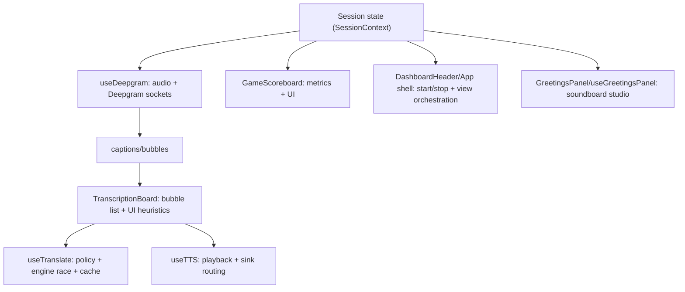

## Interview Module Map (v4.76.0)

**Agent handoff:** [`docs/handoff/README.md`](../handoff/README.md)

### How to use this doc
Use it like a file-based “feature index”:
1. Pick a domain: session/call, STT/bubbles, translation/TTS, scoreboard, soundboard.
2. Jump to the listed file(s).
3. Follow the “Responsibility” notes to understand what to change (and what not to).

### Runtime boundaries (quick map)

### Feature → Responsibility → File(s)

#### App shell / view orchestration
- Responsibility: decides which “workspace” is visible (off-call scoreboard vs soundboard studio vs call UI), wires attach/connect/start handlers, and controls app-level UX (idle vignette, hotkeys, background image).
- Main file: [`src/App.js`](src/App.js)

#### Session state + timers + persistence (including HIPAA grace)
- Responsibility: single source of truth for call/break/avail, session timers, daily/monthly stats rollover, caption persistence, and HIPAA disconnect grace lifecycle.
- Main file: [`src/contexts/SessionContext.js`](src/contexts/SessionContext.js)

#### STT / Deepgram websocket lifecycle + transcript → sealed bubbles
- Responsibility: acquires audio stream (tab capture vs mic), manages Deepgram EN/ES websocket lifecycle + reconnection, and converts raw interim/final transcript fragments into UI-ready “sealed bubbles” (sentences + comma chunking).
- Main file: [`src/hooks/useDeepgram.js`](src/hooks/useDeepgram.js)

#### Transcript UI + bubble rendering + number protection/copy
- Responsibility: renders bubbles, pinned captions, bubble split/collapse UX, transcript scrolling behavior, selection popovers, and number/phone highlighting + click-to-copy behavior.
- Main file: [`src/components/TranscriptionBoard.js`](src/components/TranscriptionBoard.js)

#### Translation policy + engine selection + caching + sticky language pair
- Responsibility: decides when to translate, splits into stable segments, races translation engines (DeepL/OpenAI/Google gtx), caches results, and locks language pairs once translation is successful to prevent flip-flops.
- Main file: [`src/hooks/useTranslate.js`](src/hooks/useTranslate.js)

#### TTS playback + sink routing (with browser fallback)
- Responsibility: starts/stops TTS playback, uses preloaded audio when available (currently disabled), falls back to `SpeechSynthesisUtterance`, and routes audio to the selected sink.
- Main file: [`src/hooks/useTTS.js`](src/hooks/useTTS.js)

#### Scoreboard UI (metrics grid + cue text)
- Responsibility: renders the scoreboard tiles (emoji/progress rows), overlays/tooltip behavior on hover, and compact cue text for shift/pacing/break left. Metrics calculations are embedded or sourced via props from session state.
- Main files:
  - [`src/components/GameScoreboard.js`](src/components/GameScoreboard.js)
  - Hosted in [`src/components/DashboardHeader.js`](src/components/DashboardHeader.js)

#### Soundboard studio (off-call greetings)
- Responsibility: loads soundboard clips from storage, records new clips, runs a “health” check on greetings (Deepgram transcript + confidence heuristic), manages playback routing to the selected sink, and provides edit/settings UI.
- Main files:
  - [`src/components/GreetingsPanel.js`](src/components/GreetingsPanel.js)
  - [`src/hooks/useGreetingsPanel.js`](src/hooks/useGreetingsPanel.js)

#### Audio editor (waveform, region selection, splicing)
- Responsibility: waveform rendering, selection drag handles, silence detection overlays, and “crop / re-record region” style splicing flows.
- Main file: [`src/components/AudioEditorPanel.js`](src/components/AudioEditorPanel.js)

#### SilenceGuardian (runaway silent call reminder)
- Responsibility: monitors `lastActivityTime` while active and plays tiered warnings; optionally auto-disconnects by moving the app into break state (based on silence thresholds).
- Main file: [`src/components/SilenceGuardian.js`](src/components/SilenceGuardian.js)

#### Sensitive data protection (pure utils, v4.84.7)
- Responsibility: lane-aware number words, phone/SSN, digit stitch, date/dosage/money highlight units, sentinel display brakes, NYC zip; overlap digit guards.
- Main file: [`src/utils/sensitiveDataProtector.js`](src/utils/sensitiveDataProtector.js)
- Chips/spelling: [`src/utils/transcriptFormat.js`](src/utils/transcriptFormat.js)
- Approach: [`docs/development/sensitive-data-approach.md`](../development/sensitive-data-approach.md)
- Handoff: [`docs/handoff/01_number_protection.md`](../handoff/01_number_protection.md)

#### Medical term priority (stub v4.56)
- Responsibility: score clinical tokens over generic homophones; post-process hook for STT bias.
- Main file: [`src/utils/medicalTermLexicon.js`](src/utils/medicalTermLexicon.js)
- Handoff: [`docs/handoff/02_medical_terms.md`](../handoff/02_medical_terms.md)

#### Transcript corrections (v4.76.0, local-first)
- Responsibility: user edits bubble source/translation; STT phrase replace + glossary override before translate; `localStorage` `catint_corrections_v1`.
- Main files:
  - [`src/utils/transcriptCorrections.js`](src/utils/transcriptCorrections.js)
  - [`src/components/BubbleCorrectionEditor.js`](src/components/BubbleCorrectionEditor.js)
  - [`src/components/TranscriptionBoard.js`](src/components/TranscriptionBoard.js) (wiring)
  - [`src/hooks/useTranslate.js`](src/hooks/useTranslate.js) (glossary + STT apply)
- User guide: [`docs/transcription-pane/corrections.md`](../transcription-pane/corrections.md)
- Handoff: [`docs/handoff/04_transcript_corrections.md`](../handoff/04_transcript_corrections.md)

#### ElementHint tooltips (v4.75.5)
- Responsibility: rich hover tooltips with copyable CSS selector for header/scoreboard chrome.
- Main file: [`src/components/ElementHint.js`](src/components/ElementHint.js)
- Doc: [`docs/development/element-hint.md`](../development/element-hint.md)

#### Transcript format + copy chips (v4.75.6)
- Responsibility: consolidate spelling blocks, extract copyable names/entities for chip row.
- Main file: [`src/utils/transcriptFormat.js`](src/utils/transcriptFormat.js)

#### Auth / DB (future)
- Handoff only: [`docs/handoff/06_auth_db.md`](../handoff/06_auth_db.md)

