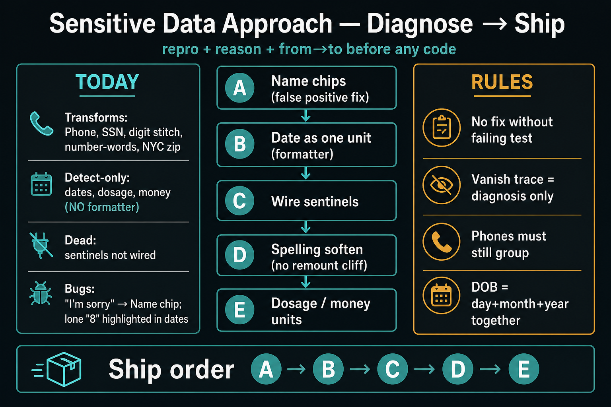

# Sensitive data — approach plan (diagnose → ship)



**Status:** Phase A–E shipped (sensitive-data approach complete for planned scope).

**Code:** `src/utils/sensitiveDataProtector.js` · chips: `transcriptFormat.js` · UI: `TranscriptionBoard.js`  
**Related:** [`../handoff/01_number_protection.md`](../handoff/01_number_protection.md) · [`vanish-trace.md`](vanish-trace.md)

---

## 0) Rule

We do not “fix” vanishing text or chips without:

1. A **repro string** (what was spoken / STT text)
2. A **reason** from `[CAT VANISH]` or a unit test that fails today
3. A **from → to** display example in this doc or the PR

If those three are missing, stop. Logging (`vanishTrace`) is diagnosis, not the product fix.

---

## 1) What exists today (inventory)

### A. Display transforms (change visible text)

| Item | Behavior |
|------|----------|
| Phone 10 | `XXX-XXX-XXXX` |
| SSN-like 9 | `XXX-XX-XXXX` |
| 11 / +1 | `+1 …` |
| Digit stitch | `5 5 5…` → `555…` |
| Number-words | EN/ES lane-aware → digits |
| NYC zip | `NY 123` → `NY 10023` |
| Address near digits | skip stitch/format |

### B. Detect-only (block overlap / stutter — **no formatter**)

Date cues · months · weekdays · ordinals · `MM/DD[/YY]` · clock · dosage (`mg/ml…`) · med+freq · money/price

### C. Sentinels written, **not wired in prod**

`detectSentinelContext`: spelling · email · ssn · phone · address · date · medication · dosage · price  
(Comment says: call before number-word/phone format; skip/limit transforms. **Nothing in live path calls it.**)

### D. Outside protector (UI / format)

| Item | Behavior | Known bug |
|------|----------|-----------|
| Spelling ≥3 “as in” | newlines + mono + chip on seal | live→seal layout cliff |
| Name chips | `I'm…` / `my name is…` / `Dr…` | `I'm sorry` → **Name sorry** |
| Digit highlight | any `\d+` yellow click-copy | day alone in “8 May 2024”; not a date unit |
| Confidence underline | low DG confidence | looks like “selection”; not copy |

---

## 2) Special cases (medical interpreting)

These must stay readable and copyable as **units**, not random digits:

1. **DOB / full date** — day + month + year (and ordinals: “May eighth twenty twenty-four”)
2. **Appointment date** — same; often with weekday
3. **Clock time** — `10:30 am` (do not eat into phone stitch)
4. **Phone** — 10 / +1; spelled digits
5. **SSN** — 9 digits; cue “social / seguro”
6. **Dosage** — `500 mg`, `2.5 ml`, freq (`bid`, `twice daily`)
7. **Address** — street number must not become phone; zip repair careful
8. **Email** — `at` / `dot` / `arroba` spelling
9. **Spelled name** — NATO / “X as in Y” → consolidate for copy, **without** destroying the spoken line mid-utterance
10. **Proper name after cue** — only after real cues (`my name is`, `me llamo`, `Dr` + Capitalized); never after `I'm sorry`

---

## 3) Phased approach

### Phase A — Stop false UI (chips) — **shipped v4.84.3**

**Bug:** `/\b(?:this is|I am|I'm)\s+(\S+)/` → `I'm sorry` = Name chip.

**From → to:**

| Input | Before | After |
|-------|--------|-------|
| `I'm sorry, doctor` | Name chip `sorry` above line | no name chip |
| `my name is Maria Lopez` (sealed) | chip above | trailing `Name · Maria Lopez` |
| live draft with name cue | chip mid-speech | no chips until sealed |

**Done:** stopwords · weak-cue Capitalized · sealed-only · trailing CSS.

### Phase B — Date as a unit (the missing formatter) — **shipped v4.84.4**

**From → to:**

| Input | Before | After |
|-------|--------|-------|
| `born May 8 1990` | yellow on `8` only | one date span; copy `1990-05-08` |
| `appointment 3/15/26` | split digits | one unit; copy `2026-03-15` |
| `take 8 mg` | yellow `8` | still number (not date) |
| `call 555…` | phone | phone (unchanged) |

**Done:** `findDateUnits` · `splitHighlightSegments` · mask before stitch · board/morph highlight.

### Phase C — Wire sentinels for real — **shipped v4.84.5**

**From → to:**

| Mode | Stitch | Phone/SSN format |
|------|--------|------------------|
| date / address / email / spelling | skip | skip |
| dosage / medication / price | allow | skip |
| phone / ssn | allow | allow |
| null | allow | allow |

Overlap/`containsCriticalData` unchanged — display brake only.

### Phase D — Spelling without destroying the line — **shipped v4.84.6**

**From → to:**

| Input | Before | After |
|-------|--------|-------|
| ≥3 “as in” live/seal | spoken → `\n` mono blocks + remount | spoken paragraph stays |
| sealed spelling | layout cliff | trailing `Spelled · SMITH` chip only |
| `formatSpellingText` | default display | opt-in helper only |

Never blanks spoken words to show only letters mid-call.

### Phase E — Dosage / money highlight units — **shipped v4.84.7**

**From → to:**

| Input | Before | After |
|-------|--------|-------|
| `take 500 mg` | yellow on `500` | one `dosage` span `500 mg` |
| `copay $25.00` | yellow digits | one `money` span |
| `call 555…` | phone | phone (unchanged) |

---

## 4) Explicit non-goals (this plan)

- No ScrambleText on live transcript
- No NER / “highlight every Proper Noun”
- No rewriting captionEngine / Deepgram for chip or date work
- No more protector refactors without a failing test named after the repro
- Vanish trace stays diagnostic; do not treat log volume as progress

---

## 5) Diagnosis tools (already in app)

```js
window.__catintVanishTrace   // why text shortened / remounted
// console filter: [CAT VANISH]
window.__catintVanishOn = false
```

Use these to confirm whether a disappear is overlap, stitch, seal split, or spelling layout — **before** changing protector math.

---

## 6) Ship order (suggested)

| Order | Deliverable | Version bump when |
|-------|-------------|-------------------|
| 1 | Phase A name-chip false positive | after tests + visual OK |
| 2 | Phase B date unit formatter + highlight | after medical date smokes |
| 3 | Phase C sentinel gate in display pipeline | after A+B stable |
| 4 | Phase D spelling layout soften | after operator OK on seal |
| 5 | Phase E dosage/money units | last |

Each ship: `npm test`, version pill, one CHANGELOG line, **from→to** examples in the PR/message.

---

## 7) Acceptance (overall)

- [x] `I'm sorry` never produces a Name chip (v4.84.3)
- [x] Full DOB/appointment date highlights/copies as one unit when month+year present (v4.84.4)
- [x] `8 mg` stays dosage; phones still group (v4.84.7)
- [x] Spelling does not blank or remount the readable sentence mid-utterance (v4.84.6)
- [x] Sentinels wired as display brakes (v4.84.5)
- [x] Existing phone/SSN/overlap tests still pass

---

<details>
<summary>Completed (context)</summary>

- Phone/SSN stitch + format + overlap digit guard (v4.15–4.18+)
- Lane-aware number words
- Vanish/derender console flags (v4.84.2) — diagnosis only
- StableTextMorph continuity invariant (v4.84.1) — separate from protector formatters
- Phase A name chips (v4.84.3) — no `I'm sorry` Name chip; sealed trailing chips
- Phase B date units (v4.84.4) — full date one highlight/copy; ISO when year present
- Phase C sentinels (v4.84.5) — display stitch/phone gated by `detectSentinelContext`
- Phase D spelling soften (v4.84.6) — spoken paragraph + Spelled chip; no newline remount
- Phase E dosage/money units (v4.84.7) — dose/money one highlight/copy span
</details>
