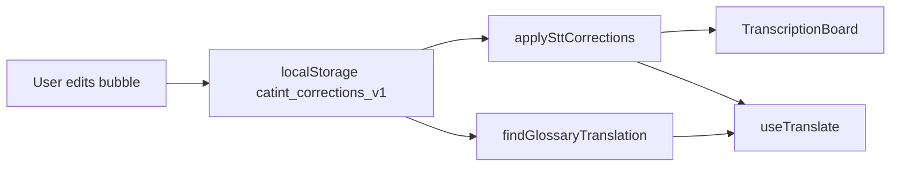

# Handoff: Transcript Corrections — **SHIPPED v4.76.0**

**User guide:** [`docs/transcription-pane/corrections.md`](../transcription-pane/corrections.md)

## Problem
STT mishears; bad transcription → bad translation. User writes over wrong text; app learns locally.

## Shipped (v4.76.0)
| Piece | File |
|-------|------|
| Floating editor (no row height change) | `src/components/BubbleCorrectionEditor.js` |
| STT + glossary store | `src/utils/transcriptCorrections.js` |
| Bubble UI (double-click / ✎) | `src/components/TranscriptionBoard.js` |
| Apply before translate | `src/hooks/useTranslate.js` |

## API
| Function | Purpose |
|----------|---------|
| `saveCorrection({ sourceHeard, corrected, lang, kind, targetLang? })` | STT or glossary upsert |
| `findCorrection(text, lang)` | Exact STT match |
| `findGlossaryTranslation(source, sLang, tLang)` | Exact glossary match |
| `applySttCorrections(text, lang)` | Phrase replace (longest first) |
| `exportCorrections()` / `importCorrections(json)` | Backup / merge |

## Acceptance ✅
- [x] UI: double-click / ✎ on source + translation columns
- [x] Modal overlay — row height unchanged
- [x] Source save → update caption + re-translate
- [x] Translation save → user override + glossary
- [x] Persists across refresh (captions + localStorage)
- [x] Tests: `transcriptCorrections.test.js`

## Not done (later)
- [ ] Deepgram keyword bias (`useDeepgram.js`)
- [ ] Partial glossary / fuzzy match
- [ ] DB sync → [`06_auth_db.md`](06_auth_db.md)
- [ ] Block overlap logic from overwriting `userCorrected` bubbles

## Touch only (future work)
- `src/hooks/useDeepgram.js` — STT bias hook
- `src/utils/transcriptCorrections.js` — fuzzy / partial glossary

## Do not touch without reason
- v4.55 scroll/memo/stability behavior in `TranscriptionBoard.js`
