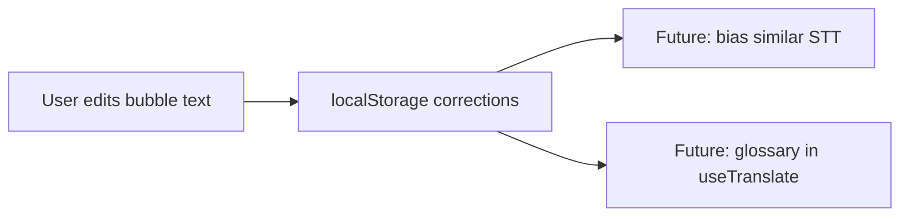

# Handoff: Transcript Corrections (Teach the App)

## Problem
STT mishears; bad transcription → bad translation. User wants to **write over** wrong text so the app learns and protects future calls.

Legacy note: `docs/agents/09_FUTURE.MD` — user clicks wrong word, writes correct one, feeds shared dictionary.

## Phase 1 — local only (no login)
Storage key: `catint_corrections_v1`  
API: `src/utils/transcriptCorrections.js`

## Stub API (v4.56)
| Function | Purpose |
|----------|---------|
| `loadCorrections()` | Read all entries |
| `saveCorrection({ sourceHeard, corrected, lang, createdAt })` | Upsert by normalized key |
| `findCorrection(text, lang)` | Exact normalized match |
| `exportCorrections()` | JSON string for backup |
| `importCorrections(json)` | Merge import |

Match strategy: normalized exact first; fuzzy matching documented for Phase 2.

## UI (Phase 2 agent — not in v4.56)
- Trigger: double-click or pencil on **source column** in `TranscriptionBoard.js`
- **Must not change row height** — modal or absolute overlay, not inline expanding panel
- On save: update bubble text, re-trigger translation, optionally auto-pin corrected bubble
- Block overlap logic from overwriting pinned/corrected text

## Touch only (Phase 2 UI)
- `src/components/TranscriptionBoard.js`
- `src/utils/transcriptCorrections.js`
- `src/hooks/useDeepgram.js` (optional STT bias hook)
- `src/hooks/useTranslate.js` (glossary injection before translate)

## Do not touch
- v4.55 scroll/memo/stability behavior without explicit task

## Acceptance
- Stub tests pass
- UI agent: correction persists across refresh; translation re-runs with corrected source
- Export/import round-trip works

## Phase
1. **v4.56:** stub + tests
2. **Next:** correction UI + wire `findCorrection` into translate path
3. **Later:** sync to DB (`06_auth_db.md`)
