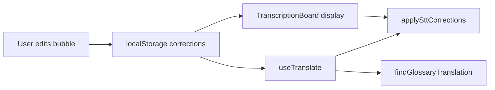

# Bubble Corrections — Teach the App (v4.76.0)

**Quick link from:** [`README.md`](README.md) · **Code:** `src/utils/transcriptCorrections.js` · `src/components/BubbleCorrectionEditor.js`

## What it does
Fix a bad **transcription** or **translation** in-place. The app remembers your fix locally and applies it on future bubbles.

| You fix | Stored as | Future effect |
|---------|-----------|---------------|
| Source (white column) | STT correction | Replaces misheard phrase in new text (≥3 chars, longest match first) |
| Translation (gray column) | Glossary entry | Exact source sentence → your translation (skips API) |

Storage: `localStorage` key `catint_corrections_v1`  
Caption fields: `userCorrected`, `sttHeard`, `userTranslationOverride` (persist in IndexedDB with captions)

## How to use (on call)
1. **Double-click** the white (source) or gray (translation) column — or hover and click **✎**
2. Edit text in the floating panel (row height does **not** change)
3. **Save & teach** — `Ctrl+Enter` · cancel — `Esc`
4. Corrected bubbles show a **green left edge**

**Source fix:** updates bubble text + re-triggers translation for that bubble.  
**Translation fix:** shows your text immediately (`userTranslationOverride`).

Only **sealed** (final) bubbles are editable — not live interim text.

## API (`transcriptCorrections.js`)
| Function | Purpose |
|----------|---------|
| `saveCorrection({ sourceHeard, corrected, lang, kind, targetLang? })` | Upsert STT or glossary |
| `findCorrection(text, lang)` | Exact normalized STT match |
| `findGlossaryTranslation(source, sLang, tLang)` | Exact glossary match |
| `applySttCorrections(text, lang)` | Phrase replace before display/translate |
| `exportCorrections()` / `importCorrections(json)` | Backup / merge |

Kinds: `CORRECTION_KIND.STT` · `CORRECTION_KIND.GLOSSARY`  
Event: `CORRECTIONS_CHANGED_EVENT` — bubbles re-apply corrections when store changes.

## Wiring


## Limits (v1)
- Glossary = **full sentence** match only (not partial phrases in translation)
- STT phrase fixes need source phrase **≥3 characters**
- No Deepgram keyword bias yet — display + translate path only
- Pinned snapshots are separate copies until re-pinned

## Backup (console)
```js
import { exportCorrections, importCorrections } from './src/utils/transcriptCorrections';
copy(exportCorrections()); // paste to file
importCorrections(paste);  // merge on new machine
```

## Tests
`src/utils/transcriptCorrections.test.js` — STT phrase replace, glossary pair, export/import.

## Later (Phase 2)
- Sync to DB: [`handoff/06_auth_db.md`](../handoff/06_auth_db.md)
- Partial glossary / fuzzy match
- Deepgram keyword bias from STT corrections
